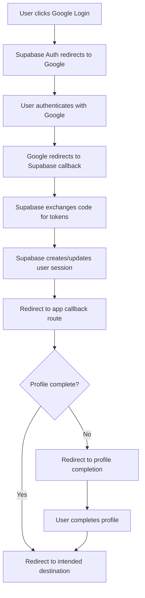

# Google OAuth Configuration Plan for Supabase

## Executive Summary

This document provides a comprehensive plan for implementing Google OAuth alongside the existing Discord OAuth in the Supabase-powered application. The plan covers Supabase dashboard configuration, Google Console setup, integration architecture, security considerations, and implementation steps.

## Current Authentication Architecture Analysis

### Existing Discord OAuth Implementation

- **Provider**: Discord OAuth 2.0
- **Client ID**: Configured via `SUPABASE_AUTH_DISCORD_CLIENT_ID`
- **Client Secret**: Configured via `SUPABASE_AUTH_DISCORD_SECRET`
- **Callback URL**: `${NEXT_PUBLIC_SITE_URL}/auth/callback`
- **Auth Flow**:
  1. User clicks Discord login button
  2. Redirects to Discord OAuth
  3. Returns to `/auth/callback` with authorization code
  4. Code exchanged for session using `supabase.auth.exchangeCodeForSession()`
  5. Profile completion flow if user data incomplete
  6. Final redirect to intended destination

### Current Components

- **Login Form**: [`components/login-form.tsx`](components/login-form.tsx) - Contains Discord OAuth button
- **Callback Handler**: [`app/auth/callback/route.ts`](app/auth/callback/route.ts) - Handles OAuth callback
- **Auth Utilities**: [`lib/supabase/auth-client.ts`](lib/supabase/auth-client.ts) - Client-side auth functions
- **Server Utils**: [`utils/supabase/server.ts`](utils/supabase/server.ts) - Server-side Supabase client
- **Middleware**: [`middleware.ts`](middleware.ts) - Session management

## 1. Supabase Dashboard Configuration Steps

### 1.1 Navigate to Authentication Settings

1. Open your Supabase project dashboard
2. Navigate to **Authentication** → **Providers**
3. Locate the **Google** provider in the list

### 1.2 Configure Google Provider

1. **Enable Google Provider**: Toggle the Google provider to "Enabled"
2. **Client ID**: Enter your Google OAuth 2.0 Client ID (obtained from Google Console)
3. **Client Secret**: Enter your Google OAuth 2.0 Client Secret (obtained from Google Console)
4. **Redirect URL**: Copy the auto-generated redirect URL for Google Console configuration
   - Format: `https://[your-project-ref].supabase.co/auth/v1/callback`
   - Example: `https://abcdefghijklmnop.supabase.co/auth/v1/callback`

### 1.3 Additional Configuration Options

1. **Skip email confirmation**: Decide if Google-authenticated users should skip email verification
2. **Scopes**: Configure requested permissions (default: `openid email profile`)
3. **Additional provider metadata**: Optional custom claims or metadata

### 1.4 Environment Variables Required

Add to your environment configuration:

```env
# Google OAuth Configuration
SUPABASE_AUTH_GOOGLE_CLIENT_ID=your_google_client_id_here
SUPABASE_AUTH_GOOGLE_SECRET=your_google_client_secret_here
```

## 2. Google Console Setup Steps

### 2.1 Create Google Cloud Project

1. Navigate to [Google Cloud Console](https://console.cloud.google.com/)
2. Create a new project or select existing project
3. Note the Project ID for reference

### 2.2 Enable Google+ API

1. Navigate to **APIs & Services** → **Library**
2. Search for "Google+ API" or "People API"
3. Click **Enable** for the API

### 2.3 Configure OAuth Consent Screen

1. Go to **APIs & Services** → **OAuth consent screen**
2. Choose **User Type**:
   - **Internal**: Only for Google Workspace users (if applicable)
   - **External**: For public applications (recommended)
3. Fill required information:
   - **Application name**: Your application name
   - **User support email**: Your support email
   - **Developer contact information**: Your email address
4. Add **Authorized domains**: Your production domain(s)
5. Configure **Scopes**:
   - Add `../auth/userinfo.email`
   - Add `../auth/userinfo.profile`
   - Add `openid`

### 2.4 Create OAuth 2.0 Credentials

1. Navigate to **APIs & Services** → **Credentials**
2. Click **Create Credentials** → **OAuth 2.0 Client IDs**
3. Select **Application type**: **Web application**
4. Configure **Authorized JavaScript origins**:
   - `http://localhost:3000` (for development)
   - `https://yourdomain.com` (for production)
5. Configure **Authorized redirect URIs**:
   - Add the Supabase redirect URL from step 1.2
   - Example: `https://[your-project-ref].supabase.co/auth/v1/callback`
6. Click **Create**
7. **Copy Client ID and Client Secret** - you'll need these for Supabase configuration

### 2.5 Domain Verification (Production)

1. Go to **Search Console** → **Domain verification**
2. Verify ownership of your production domain
3. Add verified domain to OAuth consent screen

## 3. Integration Architecture

### 3.1 OAuth Flow Architecture



### 3.2 Component Integration Points

#### 3.2.1 Login Form Updates

File: [`components/login-form.tsx`](components/login-form.tsx)

**Required Changes**:

- Add Google OAuth button alongside Discord
- Implement `signInWithGoogle()` function
- Use same callback URL pattern as Discord
- Maintain consistent UI styling

**New Function**:

```typescript
async function signInWithGoogle() {
  const redirectTo = `${process.env.NEXT_PUBLIC_SITE_URL}/auth/callback`;

  const { data, error } = await supabase.auth.signInWithOAuth({
    provider: "google",
    options: {
      redirectTo,
    },
  });

  if (error) {
    toast({
      title: "Authentication Error",
      description: error.message,
      variant: "destructive",
    });
  }
}
```

#### 3.2.2 Callback Handler Compatibility

File: [`app/auth/callback/route.ts`](app/auth/callback/route.ts)

**Current Handler Compatibility**:

- ✅ No changes required - handler is provider-agnostic
- ✅ Works with any OAuth provider that returns authorization code
- ✅ Profile completion flow applies to all providers
- ✅ Session management remains the same

#### 3.2.3 Auth Utilities Enhancement

File: [`lib/supabase/auth-client.ts`](lib/supabase/auth-client.ts)

**Potential Enhancements**:

- Add provider detection utilities
- Provider-specific profile handling if needed
- Enhanced error handling for multiple providers

### 3.3 User Profile Data Mapping

#### Google OAuth Profile Data

```typescript
// Google provides these standard claims
interface GoogleProfile {
  sub: string; // Google user ID
  email: string; // User email
  email_verified: boolean;
  name: string; // Full name
  given_name: string; // First name
  family_name: string; // Last name
  picture: string; // Profile picture URL
  locale: string; // User locale
}
```

#### Profile Completion Integration

The existing profile completion flow in [`app/auth/callback/route.ts`](app/auth/callback/route.ts) will work for Google OAuth users:

- Check for `full_name`, `username`, `date_of_birth`
- Redirect to `/auth/finish-profile` if incomplete
- Maintains consistent user experience across providers

## 4. Security Considerations

### 4.1 OAuth Security Best Practices

#### 4.1.1 Redirect URL Security

- **Use HTTPS in production**: Never use HTTP for OAuth redirects in production
- **Exact URL matching**: Google requires exact match of redirect URLs
- **Domain verification**: Verify domain ownership in Google Console
- **No wildcards**: Avoid wildcard redirect URLs

#### 4.1.2 Client Secret Management

- **Environment variables only**: Never commit secrets to version control
- **Server-side only**: Client secrets should only be used server-side
- **Regular rotation**: Rotate secrets periodically
- **Principle of least privilege**: Grant minimum required scopes

#### 4.1.3 State Parameter

- **CSRF protection**: Supabase handles state parameter automatically
- **Session binding**: State ties OAuth flow to user session
- **Validation required**: Always validate state parameter

### 4.2 Environment Variable Security

#### 4.2.1 Development vs Production

```env
# Development (.env.local)
SUPABASE_AUTH_GOOGLE_CLIENT_ID=dev_client_id
SUPABASE_AUTH_GOOGLE_SECRET=dev_client_secret
NEXT_PUBLIC_SITE_URL=http://localhost:3000

# Production (Platform environment variables)
SUPABASE_AUTH_GOOGLE_CLIENT_ID=prod_client_id
SUPABASE_AUTH_GOOGLE_SECRET=prod_client_secret
NEXT_PUBLIC_SITE_URL=https://yourdomain.com
```

#### 4.2.2 Variable Protection

- Use platform-specific environment variable management
- Enable environment variable encryption where available
- Audit access to environment variables
- Use separate credentials for development/production

### 4.3 Callback URL Security

#### 4.3.1 URL Validation

Current implementation in [`app/auth/callback/route.ts`](app/auth/callback/route.ts) includes:

- ✅ URL origin validation
- ✅ Next parameter sanitization
- ✅ Redirect URL construction with site URL

#### 4.3.2 Additional Security Measures

- **Validate referrer**: Ensure requests come from expected domains
- **Rate limiting**: Implement rate limiting on auth endpoints
- **Logging**: Log all authentication attempts for monitoring

## 5. Code Changes Required

### 5.1 Login Form Component

**File**: [`components/login-form.tsx`](components/login-form.tsx)

**Changes**:

1. Add Google OAuth button
2. Add `signInWithGoogle()` function
3. Import Google icon
4. Update UI layout for multiple OAuth providers

**Estimated Effort**: 30 minutes

### 5.2 Environment Configuration

**Files**: `.env.local`, production environment

**Changes**:

1. Add Google OAuth environment variables
2. Update deployment configuration
3. Update documentation

**Estimated Effort**: 15 minutes

### 5.3 Optional Enhancements

**File**: [`lib/supabase/auth-client.ts`](lib/supabase/auth-client.ts)

**Potential Additions**:

1. Provider detection utilities
2. Provider-specific error handling
3. Enhanced user profile utilities

**Estimated Effort**: 1-2 hours (optional)

## 6. Testing and Validation

### 6.1 Development Testing Checklist

- [ ] Google OAuth button appears correctly
- [ ] Google OAuth flow initiates successfully
- [ ] User can authenticate with Google
- [ ] Callback handling works correctly
- [ ] Profile completion flow works for Google users
- [ ] Session management works correctly
- [ ] User can sign out and sign back in
- [ ] Error handling works for various failure scenarios

### 6.2 Production Testing Checklist

- [ ] Domain verification completed
- [ ] Production OAuth credentials configured
- [ ] HTTPS redirect URLs working
- [ ] Error monitoring in place
- [ ] Performance impact measured
- [ ] Security audit completed

### 6.3 Cross-Provider Testing

- [ ] Users can switch between Discord and Google
- [ ] Existing Discord users unaffected
- [ ] Multiple OAuth providers work simultaneously
- [ ] Profile data consistency maintained

## 7. Deployment Steps

### 7.1 Pre-deployment Checklist

1. ✅ Google Console project created and configured
2. ✅ OAuth consent screen approved (if external)
3. ✅ Domain verification completed
4. ✅ Supabase provider configuration tested
5. ✅ Environment variables prepared
6. ✅ Code changes implemented and tested

### 7.2 Deployment Sequence

1. **Deploy code changes**: Update login form with Google OAuth
2. **Configure environment variables**: Add Google OAuth credentials
3. **Enable Supabase provider**: Activate Google in Supabase dashboard
4. **Test production flow**: Verify complete OAuth flow
5. **Monitor and validate**: Check logs and user feedback

### 7.3 Rollback Plan

1. **Disable provider**: Turn off Google in Supabase dashboard
2. **Revert code changes**: Remove Google OAuth button if needed
3. **Remove environment variables**: Clean up configuration
4. **Communicate**: Notify users of temporary unavailability

## 8. Monitoring and Maintenance

### 8.1 Key Metrics to Monitor

- **OAuth success rate**: Track successful Google authentications
- **Error rates**: Monitor authentication failures
- **Performance impact**: Measure page load times
- **User adoption**: Track usage of different providers

### 8.2 Maintenance Tasks

- **Credential rotation**: Regularly update OAuth secrets
- **Scope review**: Audit requested permissions periodically
- **Security updates**: Keep dependencies current
- **Provider updates**: Monitor Google OAuth API changes

## 9. Documentation and Training

### 9.1 User Documentation

- Update login help documentation
- Create troubleshooting guides
- Document account linking procedures

### 9.2 Developer Documentation

- Document environment variable setup
- Create deployment runbooks
- Update authentication architecture diagrams

## Conclusion

This plan provides a comprehensive approach to implementing Google OAuth alongside the existing Discord OAuth. The integration leverages the existing authentication architecture and requires minimal code changes while maintaining security best practices and user experience consistency.

**Estimated Implementation Time**: 2-4 hours
**Risk Level**: Low (building on existing proven architecture)
**User Impact**: High (additional convenient sign-in option)
